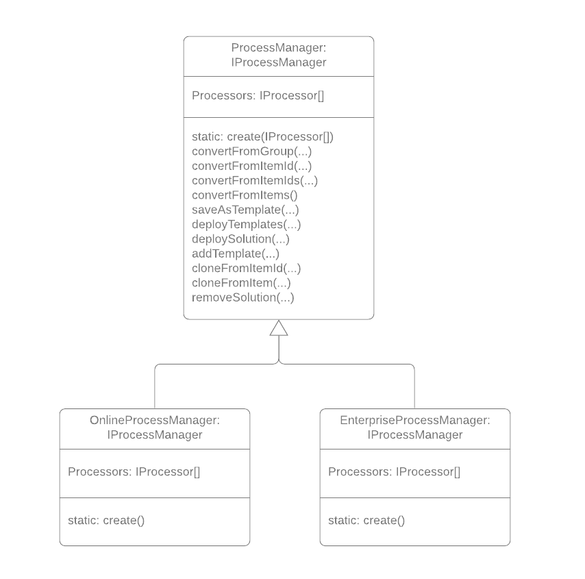

# Class Wrappers

While the core of the Solution system is written in a functional style, in order to make using the library as simple as possible, we will also provide some class wrappers over the functions. Consumers of Solution.js are free to access the underlying functions, or lean on the following classes.

## ProcessManager Class 
Instances of this class manage the entire process. The constructor takes an array of `IProcessor` types, and the class wrapper exists purely to hold onto these. It implements the [IProcessManager](./interfaces.md#IProcessManager) interfaces.

Allowing the consumer to choose the `IProcessor`s to inject allows for finer grained control over what types will be supported in the consuming application, as well as reducing the overall size of the application (assuming the consuming application uses modern build tooling capable of [treeshaking](https://developers.google.com/web/fundamentals/performance/optimizing-javascript/tree-shaking/), i.e. webpack or rollup)

## OnlineProcessManager Class
This class extends the `ProcessManager` class, and it's constructor is already pre-populated with the `IProcessor`s that are supported in the ArcGIS Online environment. We expect the Solution.js UI apps and Hub to be immediate consumers of this class

## OnlineProcessManager Class
This class extends the `ProcessManager` class, and it's constructor is already pre-populated with the `IProcessor`s that are supported in the ArcGIS Enterprise environment. We expect the Solution.js UI apps and Hub to be immediate consumers of this class
