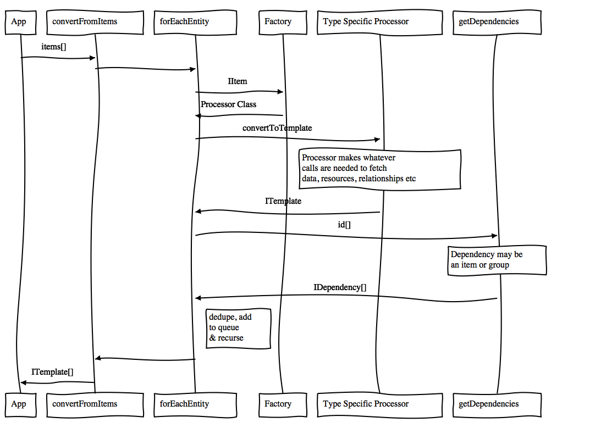
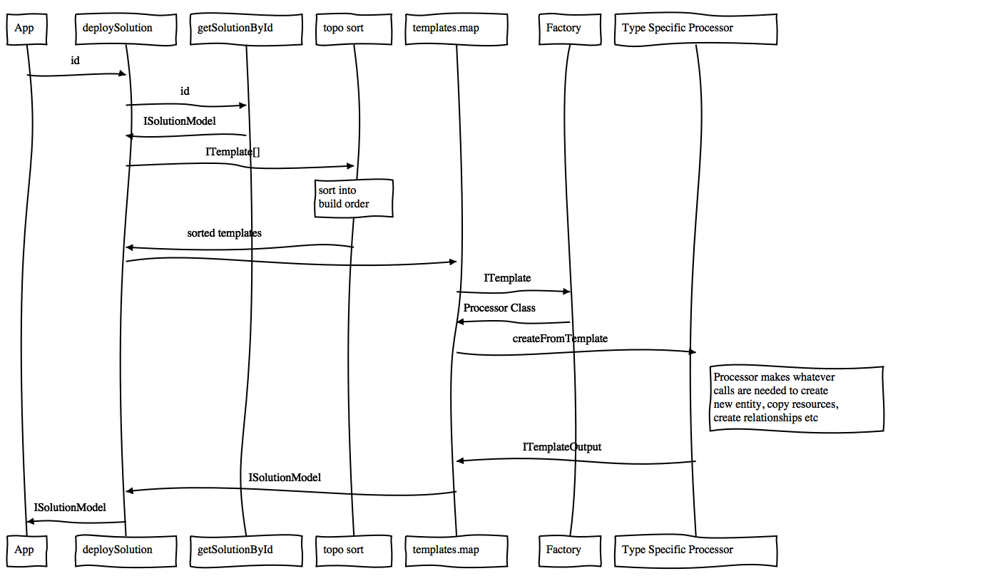

# Solution.js API

The three main processes make up the "core" of the Solution.js system:
- **Conversion**: transform an item/items/group to an array of templates
- **Persistence**: store an array of templates in a "Solution" item
- **Deployment**: create and connect a stack of new items, from an array of templates, optionally creating a Solution Item that has links to all the created items


# Conversion Functions

Key changes to this area of the codebase:
- entire process should occur in-memory
- the conversion process should delegate as much as possible to the [Type Specific Processors](./terminology.md#type-specific-processors). 
  - i.e. a Processor should know how to handle it's specific resources, info files etc etc, vs having some shared code try to handle all the possible cases
- core "orchestration" function should still report progress and handle clean-up on failures, without introducing side-effects
- support various logging levels to make debugging in production possible

The "Conversion" functions all return an array of `ITemplate` objects. This can then be directly used in the Deployment functions or persisted in a Solution item



## Group Dependencies

**PROBLEM** Some items depend on a group. Sometimes the group must simply exist, in other cases, the content of the group should be included in the template.
conv
**CURRENTLY** As an item is templated, the id of any group that it depends on is returned in the `dependencies` array. When that array is processed, the system detects it is an Group, and creates a Template for it. By default the content of the group is *not* templated, rather the templating process itself is curated to ensure the correct items are included in the Solution.

**PROPOSED**
If an item Processor determines a Group is required, it fetches the Group, returns an `IGroupTemplate` as an entry in the `ITemplate[]` array returned from `convertToTemplate(...)`. If it wants the group contents templated, it should fetch all the item ids for the items in the group, and return them in `.dependencies[]` of the `IGroupTemplate`.


## Convert Group Content to Templates

```js
export convertFromGroup(
    groupId:string,
    options: IProcessOptions
  ):Promise<ITemplate[]> {...}
```
Fetches the content of the group and delegates to `convertFromItems`. *The group itself will not be included as a template.*

This function should get all the `IItem`s shared to the group, and then pass that into `convertFromItems(...)`

## Convert Item to Templates

Three functions handle various scenarios depending on what the consuming app has already loaded.

```js
export convertFromItemId(
    itemId:string, 
    options: IProcessOptions
  ):Promise<ITemplate[]> {...}
```

Which delegates to...

```js
export convertFromItemIds(
    itemIds:string[], 
    options: IProcessOptions
  ):Promise<ITemplate[]> {...}
```

which fetches the items and delegates to...

```js
export convertFromItems(
    items: IItem[], 
    options: IProcessOptions
  ):Promise<ITemplate[]> {...}
```

This orchestrates the conversion, by delegating to type-specific processors, and returns and array of `ITemplate` objects.

*Note*: At this stage, the `resources` in the `ITemplates` will have a `url` property that points to the original location for item resources. 

*Note*: Some type specific processors may return Groups that are required for the item. This is why we use `ITemplate` not `IItemTemplate`, although most templates will be for items. The core orchestrator code is responsible for storing the `IGroupTemplate`'s in the `data.groupTemplates` array.


# Peristence Functions
This is a new feature introduced into the system. Currently the Conversion process directly creates the Solution Template Item.

Decoupling this step allow for more flexibility in how the library is used, including a platform-wide "Clone Item" feature.

```js
export saveAsSolutionTemplate(
    solutionInfo: IItemAdd, 
    templates: ITemplate[],
    options: IProcessOptions
  ):Promise<ISolutionModel> {...}
```

*Note*: This process must also copy each of the `ISolutionResource`s to a resources of the Solution item itself, updating the `ISolutionResource.sourceUrl` property as it does so.

**Reference** [IItemAdd](https://esri.github.io/arcgis-rest-js/api/types/IItemAdd/): Baseline information to create an item, in this case specific to creating the Solution item. We may change this to a more minimal interface.

# Deployment Functions
This is the process of converting from templates, back into fully operational items.

Key changes to this area of the codebase:
- actual deployment process should work from an in-memory object, and not require a Solution item
- all functions in the deployment process should return promises, and rely on the resolution/rejection of promises vs relying on side-effects
- the deployment process should delegate as much as possible to the type specific processors. 
- the core orchestration function should still report progress and handle clean-up on failures, without introducing side-effects
- support various logging levels to make debugging in production possible




## Handling sharing of deployed items to Groups
- Groups should always be created before any items
- `GroupProcessor` will handle the sharing of items to the group in the `postProcess` hook. 


## Deploy Templates Directly

Used in "cloning" workflows - allows for direct deployment of an in-memory array of templates. 

```js
export deployTemplates(
    templates: ITemplate[], 
    options: IDeploymentOptions,
  ):Promise<ITemplateOutput[]> {...}
```

**Note**: This does not create a Solution Item with references to the deployed items.


## Deploy from Solution Template Item

Deploys the templates, based on a Solution Template item and returns a new Solution item that contains references to the deployed items.

```js
export deploySolution(
    itemId: string, 
    options: IDeploymentOptions,
  ):Promise<ISolutionModel> {...}
```

## Privilege and License Check

Used internally but also exported so UI's can determine if a given user can deploy a given list of templates. Simply iterates the templates, gets the type specific processor, and calls `canUserDeployTemplate(...)` on that. It collects all the responses and if any block the deployment, the collection of errors is returned so that the consuming app can display an appropriate message to the user.

```js
export canUserDeployTemplates(
  user: IUser, // IUser is imported from REST-JS,
  templates: ITemplate[], 
  authentication: IAuthenticationManager
): Promise<IDeployable>
```

## Add Template to Solution

In addition to adding the template to the templates array, this also handles the id replacement through all the other templates.

```js
export addTemplate(
  newTemplates: ITemplate[],
  templates: ITemplate[], 
  authentication: IAuthenticationManager
): Promise<ITemplate[]>
```


## Remove Template from a Solution

Given the id of a specific template, this will remove it, and any of it's dependencies not required by any other templates, from the templates array.

```js
export removeTemplate(
  templateId: string,
  templates: ITemplate[], 
  authentication: IAuthenticationManager
): Promise<ITemplate[]>
```

## Clone Item
Handles the entire "cloning" process. With this process, the Privilege and License Check must be run after the Templates are created, but before the deployment process begins. 

**Note**: This does not create a Solution item with references to the deployed items.

```js
export cloneFromItemId(
    itemId: string, 
    options: IDeploymentOptions
  ):Promise<ITemplateOutput[]> {...}
```

Which delegates to:

```js
export cloneFromItem(
  item: IItem, 
  options: IDeploymentOptions
  ):Promise<ITemplateOutput[]> {...}
```

We don't anticipate a requirement to clone the entire contents of a group, although all the underlying functions would exist to implement that if the need arises.  **TODO**: May need to clone contents of the group used by the Crowdsource apps; the group contains the Webmaps used in the apps. 

## Removing a Solution

In order to cleanly remove a Solution, we should have a function which once again delegates to the Type Specific Processors to delete the items cleanly, doing any type-specific logic (i.e. removing domain entries for Sites)

```js
export removeSolution (
  itemId: string, // solution item id
  options: IProcessOptions // options for status callback and auth
): Promise<IProcessStatus> {...}
```