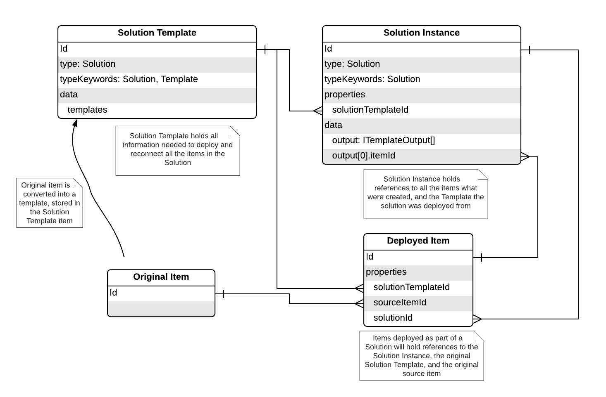

# Solution Lineage

Solution Lineage is the concept of being able to trace from instances of Solutions / Items back to their original source templates, and/or source items.

Goals:
- track a deployed item back to:
  - the Solution Template Instance it is related to (`solutionId`)
  - the Deployed Solution it was created by (`deployedSolutionId`)
  - the original item it was templated from (`sourceId`)

- track a Solution Instance back to
  - the Solution Template it was created from (`solutionId`)

Creating the lineage requires simply holding various id's in properties of the various items, as shown in the following diagram


[LucidCart Drawing](https://app.lucidchart.com/documents/edit/81a92f85-ae50-4f65-9e33-0ef9c9d8e6f1/0_0?beaconFlowId=392572DB9C8DD27B#?folder_id=home&browser=icon)


## Lineage Json
Stored in `item.properties` and thus not searchable, but we can traverse the ids. For simplicity of access, we should use these properties when programatically accessing the Ids (vs parsing typeKeywords)


```js
// Example for a Deployed Solution Instance
{
  ...
  properties: {
    solutionTemplateId: 'bc7', // Solution Template
  }
  ...
}
```

```js
// Example for a Deployed Item
{
  ...
  properties: {
    solutionId: '3ef', // Solution Template
    deployedSolutionId: 'bc7', // Solution Instance
    sourceItemId: '87c', // original item id
  }
  ...
}
```

### Searchable Lineage
Existing solutions already employ similar typekeywords for similar purposes:

```js
{
  ...
  typeKeywords: [
    "solutionid-3ef",
    "deployedSolutionId-bc7",
    "deployedSolutionId-dd3", // multiples are valid
    "sourceid-87c"
  ],
  ...
}
```

Associations with multiple deployed solutions are possible. This happens when a Solution Template is deployed multiple times, and the user opts to use some existing items - typically services or maps.

